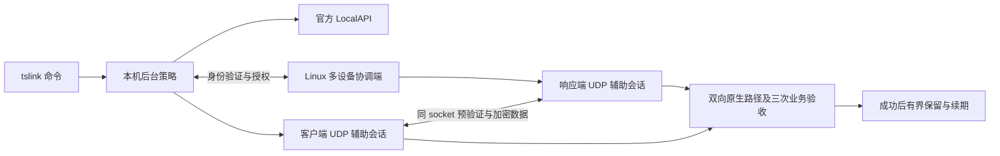

# 实现架构与后续范围

当前产品版 `0.8.0-service-controls`，采用外部辅助程序与官方客户端配合。官方 Tailscale 负责身份、发现密钥、加密隧道和基础选路；本程序负责有界恢复策略、两端协调、新 UDP 会话与验收，不拥有或读取 WireGuard / discovery 私钥。

## 数据与控制流程

## 模块

| 位置 | 职责 |
| --- | --- |
| `cmd/tslink`、`internal/product` | 产品命令、私有原子配置、平台服务、心跳、需求和中继判定、退避与续期 |
| `internal/adapter` | 官方 LocalAPI、系统接口与路由、当前节点元数据、动态候选与固定原生动作 |
| `internal/optimize` | 经 WhoIs 验证的多设备协调、首发顺序屏障、原生引导、完整业务验收 |
| `internal/mapping` | 新 UDP socket、同 socket STUN、预验证、有限探测采集、辅助承载与 IPC 生命周期 |
| `internal/diagnostic`、`internal/model` | 结构化状态、主动路径观测、证据字段及分类 |
| `cmd/ts-direct`、`internal/cli` | 兼容诊断与手动优化接口，内部独立 UDP worker |

## 已交付策略

从本轮原生已认证节点信息和物理路由重新生成候选；每个新 socket 自己执行 STUN，与后续数据使用相同 socket。已认证协调端提供同会话新映射，过期、错节点、错会话和不可用观测被拒绝。

对端首发完成的 ACK 是本机主动预验证的前置条件。UDP 往返证明只允许进入原生引导，不等于 Tailscale 身份验证。双方原生验证任务在引导前各自准备，避免等待尚未建立的路径承载触发请求。

复制的原生探测事务必须老化，避免旧目标被归因为新辅助会话。只有原生身份和双方路径通过后才启用加密数据转发；失败关闭，完整保留首个失败试次。三次业务校验还要求两端辅助承载字节增加。

自动运行以外部通信需求为条件，不把自身探测当作持续需求。配置按身份绑定，授权可动态撤销，每个响应端设备的会话隔离；客户端按本机身份和目标节点隔离本地源会话，最多保留十六个，兼容旧单会话 worker。

## 本机全节点调度

`connect --all` 只扩展本机目标选择，不扩展网络协议角色或入站权限。官方可见节点按稳定 ID 同步，单节点暂停与排除持久保留。

主循环轮转监测有需求的目标，每轮最多八次主动探测；长打洞任务在独立 worker 中串行运行，完成结果由主循环接收。待处理请求不会被观察阶段提前消费。候选任务按配置顺序轮转选取；任务开始前检查对端授权与配对响应能力。每个节点独立退避、维护报告与续期，自身流量只从对应节点的需求统计排除。

本地 IPC 按本机与对端稳定 ID 的摘要隔离，并复核完整身份；目录与记录仍受用户私有权限保护。暂停、撤销目标、身份变化及网络代次变化取消相关任务，不停止其他目标的辅助会话。跨节点已有会话不会为新搜索被驱逐。

全网角色选举、任务去重和双方共同预算仍未实施。

## 仍需实施或验收

- 任意 NAT 响应端与双桌面自动角色选举；当前 Linux 需要公网物理 IPv4。
- IPv6 新会话探索、Windows ARM64 与移动系统。
- Windows 远端引导、远程 Mac 首次管理员授权、安装邀请及图形安装体验。
- 原生网络事件与完整路由变更感知；当前只使用接口地址快照。
- 多网络对照成功率、长时间稳定性、整机重启、睡眠唤醒与自动换网实测。
- 完整发行与依赖许可说明。

未实现功能不会由交叉构建或一次现场成功推断。当前测试范围见[验收记录](validation.md)。
